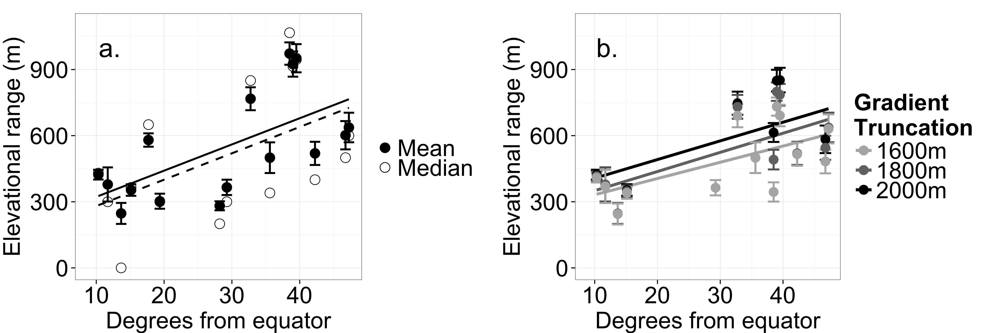
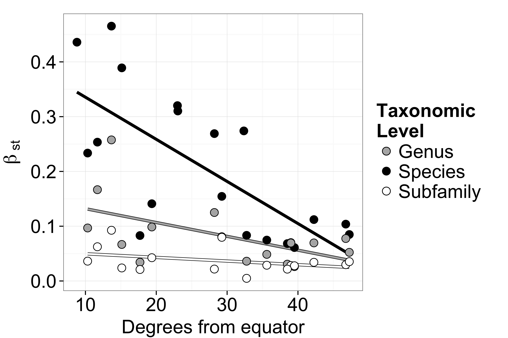
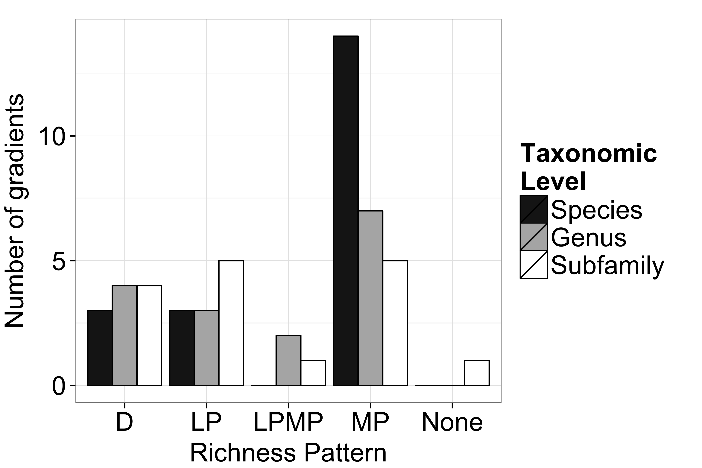
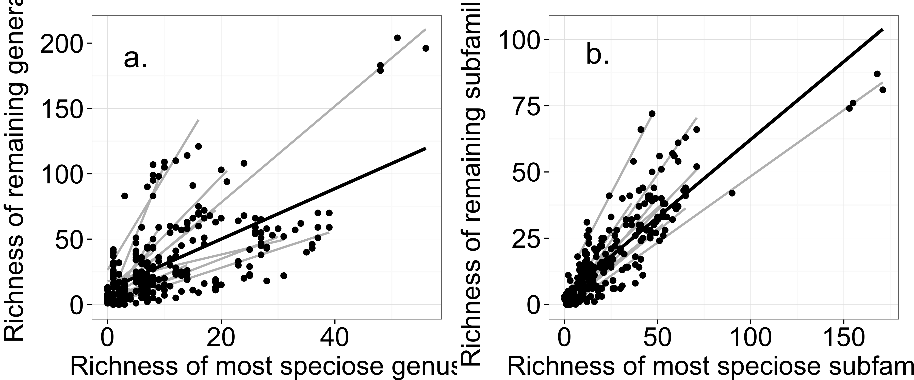

# Range size and ant communities across elevations  
**Author:** Tim Szewczyk^1^ 
  
**Affiliation:** University of Colorado-Boulder, Department of Ecology and Evolutionary Biology  
**Address:** ??  
**E-mail:** timothy.szewczyk@colorado.edu  
**Telephone:** ??  
**Fax:** ??  
**Abstract:** 150–250 words.  The abstract abstract is rather abstract.  
**Keywords:** 4–6 keywords. Formicidae, subfamily, genus, altitude, range size, beta diversity  
**Stray sentences**
Along tropical elevational gradients, ant species typically have small elevational ranges with many species detected at just one elevation [@LongColw2011; @Olson1994; @Samson1997; @Fisher1998; @Bruhl1999]. 
Several analyses have reported support for the elevational extension of Rapoport's Rule, finding that high elevation ant species tend to have broader elevational ranges compared to low elevation species [@Olson1994; @Sanders2002; @Lessard2007]. 
In contrast, ant species ranges were largest at low elevations in Costa Rica [@LongColw2011]. 
However, a recent review found little support for this hypothesis across an array of taxa when accounting for biases in estimating the mean range size [@McCaBrac2012]. 
While elevational trends in ant communities and range sizes have been demonstrated in several systems (e.g., )[@BurwNaka2011; @Fisher1998; @Lessard2007; @LongColw2011; @MunyFoor2012]. 
Nevertheless, high species turnover is not universal among the tropical gradients and turnover is consistently low in the temperate datasets. 
With common interpretations of turnover and nestedness **CITE**, the high nestedness with low turnover along most gradients suggests that environmental filtering is more important than biotic interactions in determining the ant genus communities across elevations. 
  
\newpage  
  
# Introduction  
Patterns of species richness and community composition are directly determined by the overlap and delineation of species ranges. 
Ants are no exception. 
Discovering the patterns of overlapping ranges, the dynamics of range boundaries, and the underlying determinants is a key step in understanding the macroscale distribution of ant diversity. 
Elevational gradients provide useful study systems to investigate these patterns [@McCain2009; @McCain2010]. 
Mountains, occurring on every continent, act as compact, globally replicated systems that vary across many characteristics that may affect richness, including climate, history, and geography [@Rahbek1995; @Lomolino2001; @McCaGryt2010]. 
Detailing how ant communities change along elevational gradients, and at different taxonomic levels, may yield insight into processes affecting ant species diversity across spatiotemporal scales.  
  
Despite comprising the majority of animal species, insects have received relatively little focus in such macroecological studies [@DF2010; @Beck2012]. 
Given the astonishing array of insect diversity, no picture of biodiversity would be complete without including insects. 
Ants in particular have a number of advantages for global studies of diversity. 
As predators, competitors, scavengers, and dispersers, they have major ecological impacts in a wide variety of systems [@HollWils1990]. 
In contrast to many insect taxa, the individuals used for identification are wingless with consequently restricted movement from the nest, reducing the impact of accidentals. 
Additionally, because of the historic interest across many decades, ants are relatively well-described taxonomically compared to other insect taxa. 
Nevertheless, we know little about the ranges and less about the basic natural history of many species [@Lanan2014]. 
  
Ants are an incredibly diverse taxon by nearly any ecological metric. 
Dietary breadth ranges from specialist predators in the subfamily Amblyoponinae to generalist omnivores in the subfamily Myrmicinae. 
Nesting habits and structures are highly varied, with differences in site preferences among genera, among species, and even variability within species [@HollWils1990; AndeMcSh2001]. 
Ant species differ in worker body size [@Cushman1993], degree of polymorphism [@Wilson1953], colony size [@KaspVarg1995], caste ratios [@McGlynn2012], level of aggression or dominance [@Andersen1997; @Cerda2013], and number of queens [@HollWils1977] among many other traits. 
Given this tremendous range of biological characteristics, it seems reasonable to expect that factors shaping the distribution of species vary among subfamilies or genera. 
Additionally, species richness is hugely disparate among subfamilies. 
In such a diverse and numerically heterogeneous taxon as ants, patterns of species richness and compositional change may be driven primarily by the most speciose subfamily or genus rather than reflecting the tendencies of each subtaxon. 
  
Understanding the distribution of biodiversity necessitates a comprehensive, global perspective. 
Here, I review the work to date on ant communities across elevations with specific regard to elevational range sizes, community composition, and species richness. 
Using well-sampled elevational datasets, I investigate these patterns in ants at the species, genus, and subfamily level, and evaluate latitudinal trends. 
  
  
# Datasets  
To identify ant elevational distribution datasets at local spatial scales, I performed a literature search with Web of Knowledge and Google Scholar, using combinations of the keywords 'ant', 'elevation\*', 'altitud\*', 'gradient', 'diversity', and 'insect'. 
This search primarily returned studies along discrete elevational transects with sampling sites interspersed along the gradient. 
To identify ant elevational distribution datasets at regional spatial scales, I searched for publications with 'ants of' in the title. 
This search returned guides to the ant fauna of particular geopolitical regions. 
Such guides typically compile museum records and many years of collections across the region, detailing the recorded occurrences of each ant species. 
Elevational ranges were interpolated. 
That is, each species was assumed present between its lowest and highest recorded occurrence within a dataset. 
  
To restrict the analysis to robust, well-sampled datasets, I required that a dataset provide ant elevational data within a mountainous region or along a gradient and meet five *a priori* criteria: 
(1) sufficient, even sampling effort with standardized methods across the gradient; 
(2) sampling of at least 70% of the gradient; 
(3) sampling within the lowest 400m of the gradient; 
(4) no elevational sampling gaps greater than 500m; and 
(5) relatively little anthropogenic disturbance. 
These criteria, adapted from previous studies [@McCain2009; @McCain2010], are required to ensure the accurate description of the naturally occurring pattern [@McCoy1990; @McCoy2002; @McCain2005b; @Rahbek2005; @NB2008].
The common richness patterns, however, differ primarily across the lower portion of the elevational gradient [@NB2008]. 
Consequently, violations of the second criterion were allowed when the majority of the unsampled region was at high elevations where declining richness had been demonstrated. 
   
A total of 68 candidate datasets were identified (Appendix). 
A number of publications used non-independent datasets or sampled geographically disparate sites, leaving 47 independent datasets that detailed ant distributions or richness within a single region or along a gradient. 
There were 20 that met all five *a priori* sampling criteria, with 16 of those providing species-level elevational range data. 
Thus, the majority of published studies describing ant richness across elevations did not employ sampling regimes sufficient to confidently capture the underlying richness pattern. 
Nevertheless, the robust datasets included local and regional scales, tropical and temperate zones, mainland and island gradients, and wet and arid climates (Appendix). 
  
Using definitions from the literature [@McCain2009; @McCain2010], I classified the ant elevational richness pattern along each gradient into one of six categories: 
(1) decreasing, where richness is highest at the mountain base, declining steadily with increasing elevation; 
(2) low plateau, where richness is consistently high across at least the lowest 300m before declining; 
(3) mid-peaks, where richness peaks >300m from the mountain base and with >25% greater richness than at the base; 
(4) low plateaus with mid-peaks, where richness peaks at least 300m from the base, but is also high across the lowest 300m; 
(5) increasing, where richness increases with elevation; 
(6) no pattern, where richness did not show a consistent pattern across elevations. 
  
  
# Elevational range size  
Seasonal temperature variation is more dramatic in temperate locations than in tropical locations. 
Consequently, tropical organisms experience a narrower range of temperatures annually and are expected to have narrower thermal tolerances [@Janzen1967]. 
On mountains, this results in smaller elevational ranges in tropical species [@Janzen1967; @Ghalambor2006; @McCain2009b]. 
Latitudinal trends in thermal tolerances and elevational range sizes have been detected in both vertebrate and invertebrate taxa [@McCain2009b; @Sunday2011; @ShelTewk2014; @Sheldon2015]. 
While ants have not been evaluated comprehensively, small elevational range sizes have been noted along several tropical mountains, with many species detected at only one elevation [@LongColw2011; @Olson1994; @Samson1997; @Fisher1998; @Bruhl1999]. 
  
Because the largest possible elevational range size is the entire gradient, comparisons among gradients may be sensitive to gradient height [@McCain2009b]. 
To minimize the influence of disparate gradient heights, I analysed truncated gradients [@McCain2009b] in addition to complete gradients (*n~complete~*=16). 
For each of three truncation heights (1600m: *n*=13; 1800m: *n*=12; 2000m: *n*=10), I excluded gradients shorter than the threshold. 
The remaining datasets were truncated at the threshold such that only the lowest 1600m, 1800m, or 2000m were included. 
Mean elevational ranges were then calculated along each truncated gradient. 
  
Mean elevational range significantly increases with latitude in all four sets of gradients (Fig. 1; all: *n*=16, *P*=0.009, *R^2^*=0.353; 1600m subset: *n*=13, *P*=0.021, *R^2^*=0.344; 1800m subset: *n*=12, *P*=0.012, *R^2^*=0.437; 2000m subset: *n*=10, *P*=0.033, *R^2^*=0.384). 
Ant species elevational ranges do, therefore, appear to be larger in the tropics, consistent with other taxa [@McCain2009b; @ShelTewk2014; @Sheldon2015] and with the seasonality hypothesis [@Janzen1967]. 
However, this latitudinal trend in elevational range size does not hold at larger taxonomic scales. 
Neither the mean genus elevational range size nor the mean subfamily elevational range size changes across latitudes (genus: *n*=16, *P*=0.22; subfamily: *n*=16; *P*=0.40). 
This suggests that, while individual species may be constrained by thermal tolerance, the variability in thermal tolerance among species within each genus is great enough to encompass the increased annual variation at high latitudes. 
  
Because high elevations, like high latitudes, also experience increased climatic variability, the mean elevational range size may increase with elevation [@Stevens1992]. 
To avoid the disproportionate influence and non-independence of large-ranged species, I estimated mean range size at each elevation using two methods [@McCaBrac2012; @Gaston1998; @Rohde1993]. 
In the midpoint method, the mean range size at each elevation is estimated as the average range of all species whose midpoints occur at that elevation. 
With the quartile method, only species with ranges < 1/4 of the gradient are used. 
Contrary to expectations, there is little evidence that the mean ant species range size increases along elevational gradients using either method (Midpoint: SLR *b*>0 with *P*< 0.05 in 2/16 gradients, *R^2^* mean: 0.15, median: 0.03; Quartile: SLR *b*>0 with *P*< 0.05 in 3/16 gradients, *R^2^* mean: 0.20, median: 0.14). 
  
Thus, though ant elevational ranges do not show a consistent pattern along single elevational gradients, they do tend to increase with latitude. 
The thermal tolerances of tropical ant species may, in fact, be narrower than those of temperate species. 
Alternatively, smaller elevational ranges are also consistent with stronger interspecific competition in the tropics [@Pianka1966; @Willig2003], though of course these hypotheses are not mutually exclusive. 
Regardless, the smaller elevational ranges in the tropics should lead to more pronounced changes in the ant community composition across tropical elevational gradients. 
  
  
# Species composition & beta diversity  
In a broad sense, beta diversity quantifies the variation in the species composition across space or time [@Anderson2011]. 
That variation can occur either through the replacement of one species for another, called *turnover*, or through the loss or addition of species, called *nestedness* [@Baselga2010; @Baselga2012; @Legendre2014]. 
Total beta diversity can be partitioned into turnover and nestedness to compare the proportion of compositional change resulting from the replacement or addition of species, respectively [@Baselga2010]. 
Turnover and nestedness are likely driven by different processes. 
Understanding the elevational pattern of each can clarify the importance of ecological filtering, biotic interactions, and neutral processes in structuring ant communities **CITE**[@Svenning2011]. 
  
To compare gradient-wide beta diversity, I calculated overall beta diversity as [@Tuomisto2010]:  

$$D_\beta = \frac{\gamma}{\bar{\alpha}}$$  

where $\gamma$ is the total richness along the gradient and $\bar{\alpha}$ is the average richness of the sampled elevational bands. 
Because this method is affected by the number of sampled elevational bands, I standardized $D_\beta$ as:  

$$\beta_{st} = \frac{D_\beta - 1}{N - 1}$$  

where *N* is the number of elevational bands [@Chao2012]. 
To explore gradient-wide turnover and nestedness as well as the change in ant communities between adjacent sites along each gradient, I used the Sørensen-family metrics in the R package *betapart* to calculate beta diversity, turnover, and nestedness [@Baselga2010; @Baselga2012; @BaseOrme2012]. 
These indices allow for unbiased comparisons among communities of differing richness [@Baselga2012]. 
I calculated each component using the species composition, genus composition, and subfamily composition at each elevation. 
  
### Species  
At the species level, gradient-wide beta diversity ($\beta_{st}$) decreases significantly with latitude (Fig. 2, black; *n*=20, *P*<0.001, *R^2^*=0.49). 
Consistent with the smaller elevational ranges at low latitudes, the ant species composition changes more rapidly across elevations at low latitudes. 
The proportion of gradient-wide beta diversity due to turnover does not vary significantly between tropical and temperate mountains (Fig. 3; Wilcoxon rank sum test: *W*=41, *P*=0.26). 
Overall, turnover constitutes a greater proportion of gradient-wide beta diversity than does nestedness at the species level (Fig. 3; Paired t-test: *t~15~*=5.63, *P*<0.001). 
That is, when all pairs of elevations are compared, communities at two different elevations each commonly have distinct species. 
  
This is not the case, however, at a narrower spatial resolution. 
Rather, nestedness dominates between adjacent elevations along most gradients (STATS). 
This seemingly contradictory pattern emphasizes the importance of spatial scale to patterns of beta diversity. 
Comparing sites across the entire gradient, species replace each other and high elevation communities are distinct from low elevation communities. 
But this replacement occurs gradually across elevations. 
Species are more often distributed individually, with overlapping ranges, rather than occurring as distinct abutting communities. 
In exception, turnover is quite high between adjacent elevations for a large portion of several tropical gradients [@Fisher1998; @Samson1997; @LongColw2011], consistent with a high degree of elevational specialization resulting from some combination of competition and abiotic constraints. 
  
### Genus  
At the genus level, $\beta_{st}$ declines with latitude (Fig. 2, gray; *n*=16, *P*=0.03, *R^2^*=0.25). 
The genus composition changes more rapidly across elevations at low latitudes, though the trend is weaker than at the species level. 
The proportion of gradient-wide genus beta diversity due to turnover is significantly higher in temperate regions (Fig. 3; Wilcoxon rank sum test: *W*=49, *P*=0.042). 
However, there is high variability in the genus turnover proportion among both temperate and tropical gradients; this apparent difference may be spurious. 
At the gradient scale, genus turnover and genus nestedness are typically comparable (Fig. 3; Paired t-test: *t~15~*=-0.67, *P*=0.51). 
When all elevations along a given gradient are compared pairwise, the difference in genus composition results from both the replacement of one genus for another and the loss of genera without replacement. 
  
However, between elevationally adjacent sites, ant genera, like ant species, tend to be nested (STATS) and adjacent communities differ due to the loss of genera between elevations rather than the replacement of one genus with another. 
Along many gradients, turnover at the genus level is nearly zero between the majority of adjacent elevations. 
The primary exceptions are in the Philippines [@Samson1997], where turnover is higher than nestedness except at the highest elevations, and in the McPherson Range in Australia [@BurwNaka2011], where turnover is higher than nestedness along the lower half of the gradient. 

### Subfamily    
At the subfamily level, $\beta_{st}$ shows no relationship with latitude (Fig. 2, white; *n*=16, *P*=0.15, *R^2^*=0.08). 
The change in subfamily composition across elevations does not vary consistently with latitude. 
The proportion of gradient-wide subfamily beta diversity due to turnover is not different between tropical and temperate mountains (Fig. 2b; Wilcoxon rank sum test: *W*=45; *P*=0.08) and in fact, nearly all of the change in subfamily composition is due to nestedness rather than turnover (Fig. 3; Paired t-test: *t~15~*=-11.04, *P*<0.001). 
That is, subfamilies rarely replace one another among sites, but rather the subfamily composition of each elevation is either identical to or a subset of the composition at other elevations. 
  
Between adjacent elevations, there is no subfamily turnover along any gradient. 
Instead, there is a high degree of elevational overlap among subfamilies, resulting in communities that are subsets across elevations. 
Often, subfamilies are progressively excluded at higher elevations, likely due to environmental filtering. 
With highly nested subfamily communities, there is little evidence for competitive exclusion across elevations at the subfamily level. 
  
Thus, latitudinal trends in elevational beta diversity are contingent on taxonomic level. 
Community differences across elevations are most extreme between tropical ant species. 
Furthermore, beta diversity between adjacent elevations declines as taxonomic resolution decreases. 
The species dissimilarity is higher than genus dissimilarity (stats for *Beta~genus~* and *Beta~species~*) which, in turn, is higher than subfamily dissimilarity (stats for *Beta~subfamily~* and *Beta~genus~*). 
Most dramatically, turnover across elevations declines at higher taxonomic levels irrespective of latitude. 
Communities become increasingly nested as the differences are due not to the replacement of one taxon with another, but to the loss of taxa. 
This may occur because of competitive exclusion between congeners across elevations, though heightened sensitivity to abiotic conditions at the species level and consequent elevational specialization could also produce this pattern. 
  
  
# Richness patterns  
### Species richness  
Ant species richness shows a variety of patterns across elevational gradients. 
In the robust datasets, species richness most often peaks at intermediate elevations (14/20), though decreasing (3/20) and low plateau (3/20) patterns also occur (Fig. 4, black bars). 
Despite strong latitudinal trends in range size and beta diversity, the richness pattern distribution of tropical gradients is not significantly different than that of temperate gradients (Fisher's Exact Test: *n*=20, *P*=0.30). 
In the excluded datasets, the patterns are more variable, with mid-peaks, decreases, low plateaus, increases, and no identifiable pattern reported. 
Furthermore, decreasing patterns were roughly as common as mid-peaks in these datasets. 
This is likely an artefact of sampling bias, however. 
Of the excluded gradients detecting decreases, the majority did not sample within the lowest 400m, failing to capture the portion of the gradient where the common patterns differ the most. 
At the species level, therefore, ant elevational richness is variable among mountain ranges, though frequently highest at intermediate elevations. 
  
### Genus richness  
The number of genera across elevations typically mirrors the number of species; the genus richness pattern is the same as the species richness pattern in 11/16 gradients. 
Moreover, the distribution of genus richness patterns does not differ significantly from the species richness patterns (Fig. 4, black and gray bars; Fisher's Exact Tests: *n~species~*=20, *n~genus~*=16, *P*=0.28; *n~species~*=16, *n~genus~*=16, *P*=0.39), though there is a tendency for the peak in genus richness to be less pronounced, resulting in several low plateaus with mid-peaks not seen at the species level. 
The distribution of genus richness patterns does not vary significantly between tropical and temperate datasets (Fisher's Exact Test: *n*=16, *P*=0.11). 
The number of species increases quite predictably with the number of genera (STATS), lending further evidence that ant richness patterns are similar at the species and genus scales. 
  
### Subfamily richness  
The richness pattern of ant subfamilies along each gradient is coarsely similar to the species and genus richness patterns, though the patterns are less distinct due to the smaller number of subfamilies. 
The distribution of subfamily richness patterns is not significantly different from that of the species richness patterns (Fig.4, black and white bars; Fisher's Exact Tests: *n~species~*=20, *n~subfamily~*=16, *P*=0.10; *n~species~*=16, *n~subfamily~*=16, *P*=0.20) nor from that of the genus richness patterns (Fig. 4, gray and white bars; Fisher's Exact Test: *n*=16; *P*=0.84).
As at the species and genus levels, the distribution of subfamily richness patterns does not vary significantly between tropical and temperate gradients (Fisher's Exact Test: *n*=16, *P*=0.28).
The number of subfamilies does predict the number of species (STATS), though less reliably than does the number of genera. 
  
Ant richness, therefore, is often high at intermediate elevations whether measured at the species, genus, or subfamily level. 
Consequently, it appears that the underlying ecological or evolutionary factors driving richness are creating similar patterns at multiple taxonomic scales. 
While it may seem intuitive that the number of species would increase with the number of genera, in fact species communities can be over- or under-dispersed phylogenetically [@Webb2002], with the degree phylogenetic dispersion likely arising from the interplay of environmental filtering, neutral processes, and competition [@Webb2002; @Machac2011; @KembHubb2006]. 
The similarity in richness patterns across taxonomic levels suggests that species across the many genera and subfamilies of ants along each gradient may be responding similarly to the combination of processes affecting speciation and community assembly. 
Nonetheless, given the disparate number of species within each ant genus or subfamily, the pattern of species richness may simply result from the richness pattern of the most speciose genus or subfamily along the gradient. 
  
  
# Dominant taxa  
### Most speciose genus  
The numerical dominance of the most speciose genus is highly variable among mountain ranges. 
The most speciose genus along each gradient comprises 7–31% of the total species richness of that gradient (mean ± SE: 20.0 ± 1.57%). 
These genera include *Camponotus* [@Sabu2008], *Formica* [@Gregg1963; @Allred1982; @WheeWhee1986; @Hellrigl2003; @Glaser2006], *Lasius* [@Karaman2011], *Pheidole* [@MoodFran1982; @VanPelt1983; @Samson1997; @Fisher1998; @ArauFern2003; @BurwNaka2011; @LongColw2011], *Stenamma* [@Lessard2007], and *Strumigenys* [@SarnEcon2012]. 
The proportion of species within the most speciose genus does not vary predictably across latitudes (*n*=16, *P*=0.15, *R^2^*=0.08). 
  
The species richness of the most speciose genus, of course, strongly predicts richness across elevations (STATS). 
However, the overall pattern is not driven solely by this single genus. 
Instead, the species richness pattern of the most speciose genus is typically similar to the richness pattern of the remaining species. 
Along most gradients, the richness of the most speciose genus predicts the richness of the remaining genera quite well (Fig. 5a; STATS), though the relationship is variable among gradients (STATS: slope ranges). 
Many of the non-dominant genera are neither speciose nor widespread enough to reliably discern a species richness pattern. 
Those that are, however, tend to show a qualitatively similar elevational richness pattern both to the overall pattern and to that of the most speciose genus. 
  
### Most speciose subfamily  
The numerical dominance of the most speciose subfamily is highly variable among mountain ranges. 
The most speciose subfamily along each gradient comprises 39–73% of the total species richness (mean ± SE: 54.5 ± 2.04%). 
Along a given gradient, one of two subfamilies are dominant: Formicinae [@Gregg1963; @Allred1982; @WheeWhee1986; @Hellrigl2003; @Glaser2006] or Myrmicinae [@Sabu2008; @Karaman2011; @MoodFran1982; @VanPelt1983; @Samson1997; @Fisher1998; @ArauFern2003; @BurwNaka2011; @LongColw2011; @Lessard2007; @SarnEcon2012]. 
There is no latitudinal trend in the proportion of species contained within the most speciose subfamily (*n*=16, *P*=0.38, *R^2^*=0.06). 
  
As with the dominant genus, the species richness within the most speciose subfamily is remarkably similar across elevations both to the richness of all species (STATS) and to the richness of species in non-dominant subfamilies (Fig. 5b; STATS). 
Thus, the total species richness pattern is not simply a product of the most speciose subfamily. 
Rather, the dominant subfamily shows the same richness pattern as the remaining subfamilies. 
Furthermore, the richness pattern of each subfamily is often qualitatively similar to the overall richness pattern and to the pattern of the most speciose subfamily. 
  
Ant species richness patterns across elevations are not, therefore, driven by a single subtaxon, but rather emerge from the congruent, nested richness patterns of each genus and subfamily. 
The richness pattern within each subtaxon tends to be broadly similar to that of the whole. 
Moreover, the number of genera and, to a lesser extent, the number of subfamilies tend to correspond with the number of species across elevations. 
This suggests that the key factors shaping the richness of ants across a given elevational gradient may act on the majority of ant taxa similarly, regardless of ecological differences. 
Thus, while range sizes and changes in species composition are inherently tied to variation in species richness, they perhaps are not as directly relevant to richness patterns at the scale of elevational gradients. 
  
  
# Research gaps  
Many hypotheses have been proposed as drivers of ant community structure, richness, and diversity along elevational gradients, ranging from current climate to area to competition to habitat structure **CITE**[@Pianka1966; @Willig2003]. 
However, the consistent and reliable data needed to rigorously evaluate many of these hypotheses are lacking at a broad scale. 
Habitat complexity, and in particular vegetation structure or leaf litter depth, has been suggested as a driver of ant diversity [@LassHoch2004; @Sarty2006; @PachVasc2011; @Bharti2013]. 
Such data have not been widely collected across elevational gradients with ant species data. 
Additionally, we know little of the basic biology for many species of ants. 
Dietary, foraging, and nesting habits can vary dramatically within a genus and even within a species **CITE**. 
Understanding how biotic interactions, such as competition for space or food resources, and changes in their strength across elevations affect ant communities relies on thoroughly detailing behavior across a wide taxonomic variety of ant species. 
Finally, ant communities can vary substantially across seasons and years [@Bishop2014], variation that has rarely been accounted for. 
A greater focus on seasonal and annual fluctuations will inform mechanistic approaches to understanding patterns of ant communities. 
Finally, a recent phylogenetic analysis of tropical ants across elevations found that the ant communities were phylogenetically clustered, suggesting a strong role of environmental filtering [@Smith2014]. 
Increased focus on phylogenetic patterns may help to disentangle the interplay of ecological and evolutionary processes in shaping ant communities [@Machac2011; @Smith2014]. 
  
  
# Conclusion  
In summary, ant elevational ranges are narrowest at tropical latitudes, leading to higher gradient-wide beta diversity and high species turnover. 
This trend becomes increasingly less distinct at higher taxonomic levels where elevational ranges become broader and communities become increasingly nested. 
The elevational species richness patterns, which do not appear to be directly related to turnover, are a conglomerate property across subfamilies and genera rather than just a function of the most speciose subtaxon. 
The broad similarity of richness patterns along a given gradient, including among species, within and among genera, and within and among subfamilies, suggests that despite large biological differences, similar factors may influence the elevational distribution of ant species across many genera and subfamilies. 
  
  
---  
  
  
# Figure Legends  
**Fig. 1** Ant species elevational range sizes increase with latitude. 
(a) Both the mean (solid; ± 1 standard error) and median (open) elevational range size increases with distance from the equator (mean: *n*=16, *P*=0.009, *R^2^*=0.353; median: *n*=16, *P*=0.04, *R^2^*=0.208). 
(b) This trend does not appear to be driven by the height of the mountain. 
The mean elevational range size increases with latitude with all three truncation heights (1600m subset: black, *n*=13, *P*=0.021, *R^2^*=0.344; 1800m subset: dark gray, *n*=12, *P*=0.012, *R^2^*=0.437; 2000m subset: light gray, *n*=10, *P*=0.033, *R^2^*=0.384).  

**Fig. 2** Gradient-wide beta diversity decreases with latitude.
Total species beta diversity across each elevational gradient, standardized for the number of sampled elevations, declines with latitude (black; *n*=20, *P*<0.001, *R^2^*=0.49). 
This pattern diminishes at broader taxonomic scales with a weaker trend for genus beta diversity (gray; *n*=16, *P*=0.03, *R^2^*=0.25) and no trend for subfamily beta diversity (white; *n*=16, *P*=0.15, *R^2^*=0.08). 

**Fig. 3** Proportion of gradient-wide beta diversity due to turnover decreases with taxonomic resolution. 
In both temperate (white) and tropical (gray) gradients, the proportion of beta diversity due to turnover decreases at higher taxonomic levels. 
At 0.5 (dotted line), turnover and nestedness contribute equally to the change in community composition. 

**Fig. 4** Robust patterns of ant elevational richness patterns across taxonomic scales. 
A variety of species richness patterns (black, *n*=20) occur, though mid-elevational peaks are most common. 
The pattern distribution is similar for both species (black) and genus (gray, *n*=16) richness (Fisher's Exact Test: *n~species~*=20, *n~genus~*=16, *P*=0.28). 
Though the subfamily (white, *n*=16) richness patterns are less discernible due to the small number of subfamilies along many gradients, the distribution of patterns is not significantly different (Fisher's Exact Tests: *n~species~*=20, *n~subfamily~*=16, *P*=0.10; *n~genus~*=16, *n~subfamily~*=16, *P*=0.84).  

**Fig 5** Richness of the most speciose genus or subfamily predicts the richness of the remaining species. 
(a) The elevational richness pattern of the most speciose genus is nested within the richness pattern of the remaining species for most gradients. 
The trend is apparent with all datasets combined (black line) and within each gradients (gray lines). 
There is, however, much variability in the slope of the relationship among gradients.
(b) The nestedness of the richness patterns becomes stronger at the subfamily level. 
The relationship is strong with all datasets combined (black line) and much less variable among transects (gray lines) compared to the genus level.  
  
  
      
  
  
  
  

  

  
  
---  
    
# References  
